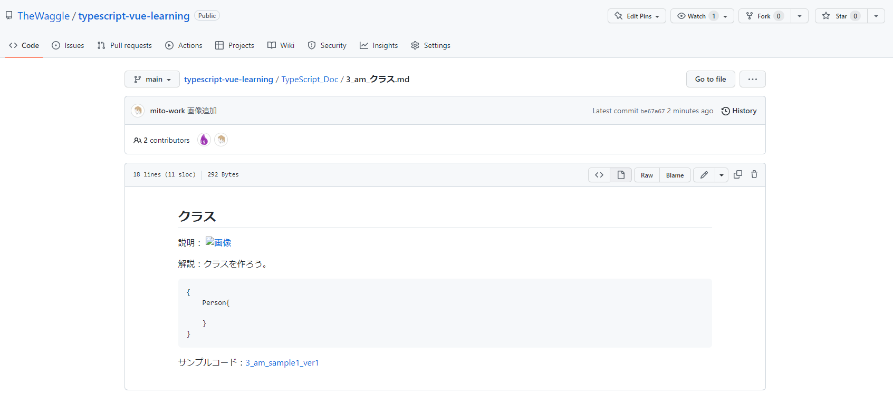

## クラス

### 0.クラスとは

汎用的に使える鋳型(設計図)と表現されることが多い。
関数と同じく、宣言のみしている状態のため実行するためには実体を作る必要
がある。
ES2015 以前はクラスの文法がなかったため、コンストラクタでオブジェクトを
初期化していた。

```javascript
//コンストラクタ関数(設計図)
function Person(name, age) {
  this.name = name;
  this.age = age;
  this.show = function () {
    console.log(`${this.name}は${this.age}歳です`);
  };
}
//インスタンス化(実体)
const p1 = new Person("理央", 30);
pa.show();
```

---

一部、汎用的な関数はプロトタイプに定義していた。クラスの 1 つ上の親のようなイメージ(デフォルトで勝手に継承されている。)メモリの消費を減らすことができる

```javascript
function Person(name, age) {
  this.name = name;
  this.age = age;
}
Person.prototype.show = function () {
  console.log(`${this.name}は${this.age}歳です`);
};
//インスタンス化(実体)
const p1 = new Person("理央", 30);
pa.show();
```

### 用語の整理

-クラス(class)
何かを作るための設計図。必要な材料や処理が書かれている
(**例えを入れる:メモリの話など分かりやすく**)

-インスタンス(instance)
クラスを元に`new`演算子を使い、作った実体のオブジェクト(集合)。

-メソッド(method)
他の言語では、メンバー関数と呼ばれる。ロジックを書く場所。

-プロパティ(property)
他の言語では、メンバー変数、フィールドと呼ばれる。名前を持ち、指定された型のデータを保持する。インスタンスごとに別の名前空間を持つ。

### 1.クラスを定義する

クラス名、プロパティ名、メソッド名はルールに乗っ取り自由に設定できるが、コンストラクタは constructor で固定。

```typescript
//`person`クラス(person設計図)
class Person {
  //string型の`name`というプロパティ
  name: string;
  //number型の`age`というプロパティ
  age: number;
  constructor(name: string, age: number) {
    this.name = name;
    this.age = age;
  }
  //戻り値がstring型の`show`という名前のメソッド
  show(): string {
    return `${this.name}は${this.age}歳です。`;
  }
}
//personクラスからオブジェクトを生成して、`p`という変数に格納する
let p = new Person("理央", 30);
//コンソールにpオブジェクトのshowメソッドを呼び出す。
console.log(p.show());

//クラスに対してインスタンス化せず、直接メソッドを呼び出す。
console.log(Person("隆史", 32).show());
```

サンプルコード：[3_am_sample1_ver1](https://github.com/TheWaggle/typescript-vue-learning/archive/refs/tags/3_am_sample1_ver1.zip)

---

<div style="page-break-before:always"></div>

### 2.アクセス修飾子

`private`と`protected`と`public`修飾子がある。
-public:クラス外からも自由にアクセス可能(既定なので敢えて書く必要はないが、コメントの意味合いで書く場合がある)
-protected:同じクラス、またはその派生クラスのメンバーからのみアクセス可能
-private:同じクラスからのみアクセス可能

```typescript
class Person {
  //クラス内のみアクセスできるstrign型の`name`プロパティ
  private name: string;
  //クラス内のみアクセスできるnumber型の`age`プロパティ
  private age: number;
  constructor(name: string, age: number) {
    this.name = name;
    this.age = age;
  }
  //クラス外からも自由にアクセスできる戻り値がstringの`show`メソッド
  //書かなくても同じ意味だが明示的に書いている
  public show(): string {
    return `${this.name}は${this.age}歳です。`;
  }
}

let p = new Person("理央", 30);
//クラス外からもアクセス可能なshowメソッドにアクセス
console.log(p.show());
//クラス内のみアクセスできるnameプロパティにアクセス
console.log(p.name);
```

サンプルコード：[3_am_sample2_ver2](https://github.com/TheWaggle/typescript-vue-learning/archive/refs/tags/3_am_sample1_ver2.zip)

### 3.コンストラクタとプロパティ設定

コンストラクタはクラスからオブジェクトを生成する際に必ず実行される関数。
その性質上、与えられた引数をもとにプロパティを初期化する用途に用いられることが多い。

```typescript
class Person {
  name: string;
  private age: number;
  //インスタンス化する際に渡されるstring型の`name`変数とnumber型の`age`変数
  constructor(name: string, age: number) {
    //このクラスのnameプロパティに引数nameの値を代入
    this.name = name;
    //このクラスのageプロパティに引数ageの値を代入
    this.age = age;
  }
}

let p = new Person("鈴木", 38);
//クラス内からしかアクセスできないageプロパティに外部からアクセス
p.age = 50;
```

サンプルコード：[3_am_sample3_ver2](https://github.com/TheWaggle/typescript-vue-learning/archive/refs/tags/3_am_sample1_ver2.zip)

### 4.getter/setter アクセッサ

プロパティのように見えるが、実際は裏でメソッドを呼び出し処理を行っているもの。
【種類】
-getter：値を返すアクセッサ
-setter:値を節制するアクセッサ
【特徴】 -読み書きを制御できる
set を使うことで読み取り専用のプロパティを、get を使うことで書き込み専用のプロパティを表せる -値のチェック/戻り値の加工などが可能
getter/setter はコードブロックなので、値を取得/設定する際に値のチェック/加工などの処理を差し込める(部品としてより高い品質を保証できる)

```typescript
class Person {
  //class内からしかアクセスできない_ageプロパティはnumber型
  //!はプログラマがコンパイラに対してこの変数はundefinedやnullになることはないと伝える記述
  private _age!: number;
  //class内からしかアクセスできない_nameプロパティはstring型
  private name!: string;

  //getterアクセサー プロパティ名age:プロパティのデータ型
  get age(): number {
    //戻り値 プロパティの値を格納するprivate変数
    return this._age;
  }
  //setterアクセサー プロパティ名age(設定値を受け取る仮引数：仮引数の型)
  set age(value: number) {
    //もし仮引数valueの値が0より小さい場合
    if (value < 0) {
      //エラーを返す
      throw new RangeError("ageプロパティは正数で指定してください。");
    }
    //private変数に値を格納する
    this._age = value;
  }
}

let p = new Person();
//setterアクセサーに10を渡す
p.age = 10;
console.log(p.age);

//プライベートプロパティに15を渡す
p._age = 15;
console.log(p.age);

//プライベートプロパティに"Bob"を渡す
p.name = "Bob";
console.log(p.name);
```

### 5.静的メンバー

オブジェクトの要素は、基本的に`new`によって生成されたインスタンスごとにデータを保持する。
メソッドも`this`は現在実行中のインスタンスを指す。
`static`をつけたプロパティは、インスタンスではなくクラスという 1 つだけの要素に保存される。
`static`メソッドもインスタンスではなくクラス側に属する。

```typescript
class Figure {
  //class外からもアクセス可能 静的プロパティ PI(プロパティ名): number型 = 値
  public static PI: number = 3.14159;
  //ckass外からもアクセス可能 静的メソッド circle(仮引数名：仮引数の型):戻り値の型
  public static circle(radius: number): number {
    //仮引数radiusの値*仮引数radiusの値*このclassのプロパティPI
    return radius * radius * this.PI;
  }
}

//new演算子でオブジェクトを生成せずとも値を参照できる
console.log(Figure.PI);
//new演算子でオブジェクトを生成せずともメソッドを使用できる
console.log(Figure.circle(5));
```

### 6.継承(Inheritance)

クラスを機能拡張する方法の 1 つが継承。
元となるクラスの機能(メンバー)を引き継ぎながら、新しい機能を追加したり、元の機能の一部だけを修正したりすること。

#### 用語の整理

-継承元となるクラス：スーパークラス、親クラス、基底クラス

-継承の結果できたクラス：サブクラス、子クラス、派生クラス

```typescript
//親クラス person
class Person {
  //子クラスでアクセスできるようにprotected プロパティ名name:string型
  protected name: string;
  //子クラスでアクセスできるようにprotected プロパティ名age:number型
  protected age: number;
  //インスタンス化されるときに実行されるconstructor(仮引数name:string型,仮引数age:number型)
  constructor(name: string, age: number) {
    this.name = name;
    this.age = age;
  }
  //showメソッド:戻り値string型
  show(): string {
    return `${this.name}は${this.age}歳です。`;
  }
}
//Personクラスを継承する子クラスBusinessPerson
class BusinessPerson extends Person {
  //workメソッド：戻り値string型
  work(): string {
    return `${this.name}はテキパキ働きます。`;
  }
}
//子クラスをnewしてオブジェクトを生成し、変数pに代入
let p = new BusinessPerson("理央", 30);
//親クラスのshowメソッドを呼び出す
console.log(p.show());
//子クラスのworkメソッドを呼び出す
console.log(p.work());

//　親クラスをnewしてオブジェクトを生成し、変数pに代入
let p2 = new Person("隆史", 32);
//親クラスのshowメソッドを呼び出す
console.log(p2.show());
//子クラスのworkメソッドを呼び出す
console.log(p2.work());
```

### 7.メソッドのオーバーライド

親クラスで定義された内容を、子クラスで定義しなおすこと。(上書きする)
オーバーライドでは、親クラスのコードを完全に書き換えてもよいが、親クラスの機能を呼び出し、子クラスで独自の機能を追加することもできる。

```typescript
class Person {
  protected name: string;
  protected age: number;
  constructor(name: string, age: number) {
    this.name = name;
    this.age = age;
  }
  show(): string {
    return `${this.name}は${this.age}歳です。`;
  }
}

class BusinessPerson extends Person {
  protected clazz: string;
  constructor(name: string, age: number, clazz: string) {
    //親クラスのコンストラクターを呼び出す
    super(name, age);
    //子クラスでは新たに、clazzプロパティにclazzを代入
    this.clazz = clazz;
  }
  //親クラスと同名のshowメソッドをオーバーライド
  show(): string {
    return super.show() + `${this.clazz}です。`;
  }
}

let p = new BusinessPerson("理央", 30, "主任");
console.log(p.show());

class Teacher extends Person {
  protected subject: string;
  constructor(name: string, age: number, subject: string) {
    super(name, age);
    this.subject = subject;
  }
  teach(): string {
    return super.show() + `${this.subject}を教えます。`;
  }
}

let t2 = new Teacher("大西先生", 45, "数学");
//親クラスのshowを呼び出す
console.log(t2.show());
```

### 8 抽象メソッド

サブクラスで機能を上書きしなければならないようにする。abstrat 修飾子で表現する。
抽象クラス=抽象メソッドを含んだクラス
抽象メソッドを継承した場合、子クラス側では抽象メソッドのオーバーライドが必須。
概念のみを記述したいときなどに使う。

```typescript
//抽象クラス figure
abstract class Figure {
  //インスタンス化するときに実行する処理(子クラスでもアクセス可能 仮引数width:number型, 子クラスでもアクセス可能 仮引数height:number型)
  constructor(protected width: number, protected height: number) {}
  //抽象メソッド　getArea:戻り値number型 中身は未定義
  abstract getArea(): number;
}

//Figureを継承した子クラスTriangle
class Triangle extends Figure {
  //getAreaメソッド:戻り値number型
  getArea(): number {
    //計算結果を戻す
    return (this.width * this.height) / 2;
  }
}

//new演算子でTriangleオブジェクトを生成、引数は10,5
let t = new Triangle(10, 5);
//getAreaメソッドを呼び出す
console.log(t.getArea());

//Figureを継承した子クラスCircle
class Circle extends Figure {
  getOuterCircumference(): number {
    return this.width * 3.14;
  }
}

let c = new Circle(10, 5);
console.log(c.getOuterCircumference());
```

説明：


解説：クラスを作ろう。

```typescript

{
    Person{

    }
}

```
