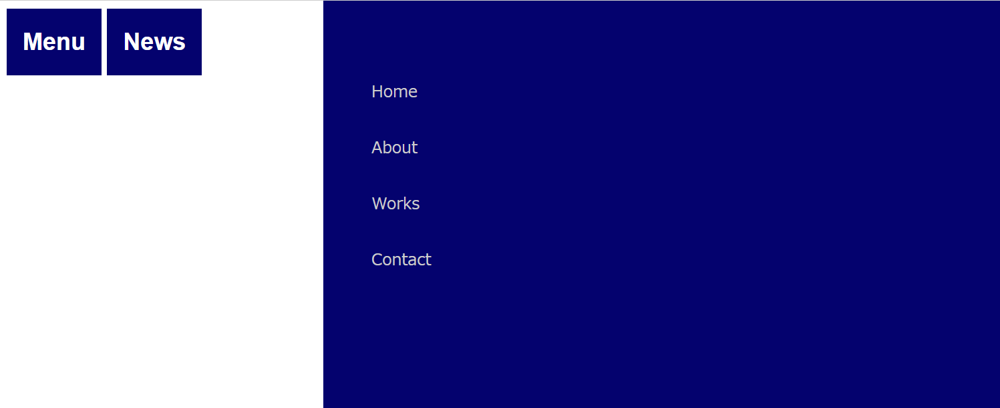
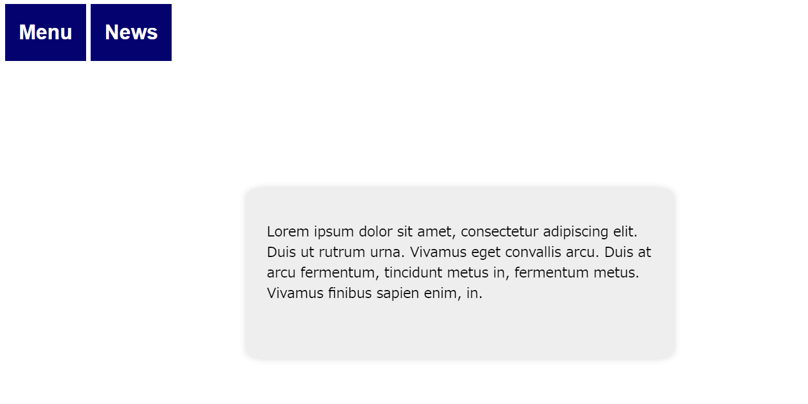

# テスト

## テスト問題 1

---

以下のコードについてどこでエラーが出ているか、なぜエラーなのかを解説しましょう。

```typescript
class Sweets {
  make: string = "Sweets";
  quantity: number = 10;
}
class Cookie extends Sweets {
  make = "Cookie";
  quantity = 4;
}
class Candy {
  make = "Candy";
  quantity = 8;
}
class Potato {
  make = "French fried potatoes";
  quantity = "No";
}

function check<T extends Sweets>(sweets: T): T {
  console.log(`There are ${sweets.quantity} ${sweets.make}.`);
  return sweets;
}
let myCookie = new Cookie();
check<Cookie>(myCookie);

let myCandy = new Candy();
check<Candy>(myCandy);

let potato = new Potato();
check<Potato>(potato);
```

<div style="page-break-before:always"></div>

## テスト問題 2

---

ジェネリック型を使い、以下のコードを意図通りに実行できるように修正しましょう。
また、コンソールに出力される内容も記載しましょう。

```typescript
function filterInput<T>(arr, predicate) {
  const answer = [];
  for (const elm of arr) {
    if (predicate(elm)) {
      answer.push(elm);
    }
  }
  console.log(answer);
  return answer;
}

const res = filterInput([1, 2, 3, 4, 5], (num) => num % 2 === 0);
const res2 = filterInput(["exam1", "ex2", "example3"], (str) => str.length >= 4);

//　結果：エラー
filterInput([1, 2, 3, 4, 5], (str) => str.length >= 4);
```

<div style="page-break-before:always"></div>

## テスト問題 3

---

「Menu」と「News」という 2 つのボタンを用意し、Menu を押すと横からメニューリストが出現し、News を押すと、文字が出現するようなプログラムを実装しましょう。

以下イメージのキャプチャです。

- 初期表示
  
- Menu 押下時(もう一度押すと消える)
  
- News 押下時(もう一度押すと消える)
  
