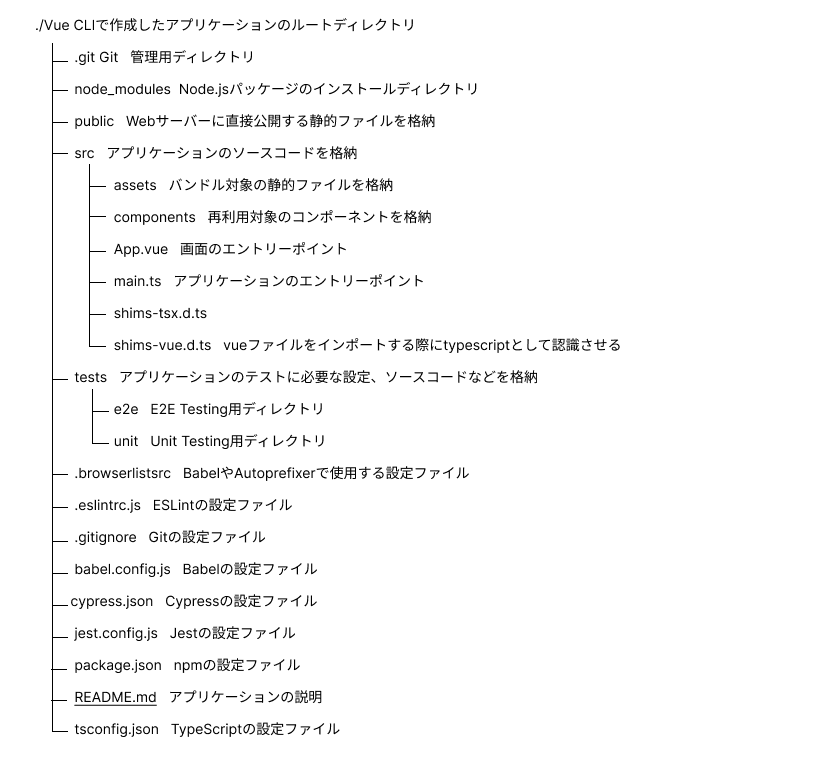

# CLI での操作

## 作成したアプリケーションの確認

---

以下のようなディレクトリ構造になっている



- `main.ts` は色々な vue を呼び出し、最終的には `bundle.js` など 1 つの js にバンドルされる
- `App.vue`は`template`と`script`と`style`に分けられる

<div style="page-break-before:always"></div>

## 用語の整理

---

Eslint と Prettier について、どちらもコードの品質を高めるためのプラグインである。

### Eslint とは

---

- JavaScript のための静的検証ツール。
- ファイル内のバグチェックやコーディングスタイルに一貫性を保つ。
- 潜在的なバグを見つけることができる。

### Prettier とは

---

JavaScript や CSS についてインデントがバラバラだとコードの可読性が下がる。チーム開発の際はインデントの数やインデントの種類は統一させるのがよい。
Prettier を使うとそのような調整を自動で行う。

- コードフォーマッター。
- ルールに沿ってコードを整形する。
- プロジェクトごとにルールを設定する。

<div style="page-break-before:always"></div>

### .prettierc ファイルとは

---

- Prettier の設定のみのファイル
- `.prettier.json`でも OK
- 細かな設定は Prettier の公式ページを確認[prettier.io](https://prettier.io/docs/en/options.html)
- 例としては以下のような設定がある

  ```json
  {
    //末尾のカンマ
    "trailingComma": "all",
    "singleQuote": false,
    "printWidth": 120,
    "tabWidth": 2,
    "useTabs": false
  }
  ```

### .eslintrc.js とは

- Eslint の設定のみのファイル
- `.eslintrc.json`でも OK
- 細かな設定は ESLint の公式ページを確認[esling.org](https://eslint.org/docs/latest/use/getting-started)
- 例としては以下のような設定がある

  ```json
  {
    "env": {
      "browser": true, //browserでみるJSですよ(nodeではない windowオブジェクトが存在する window.console.log()が使える)
      "es2021": true
    },
    "extends": "eslint:recommended", //eslintがおすすめの方法でエラーを出してくれる。(おすすめのルールを継承してくれる)
    "parser": "babel-eslint", //どれを使って検証するか
    //es-moduleを使っているということを教えている
    "parserOptions": {
      "sourceType": "module"
    },
    "rules": {
      //文末にセミコロンを必ずつける。ただし、ブロックの中に1つしか文がない場合はつけない
      "semi": ["error", "always", { "omitLastInOneLineBlock": true }]
    }
  }
  ```

<div style="page-break-before:always"></div>

## ワーク 1

---

理解があいまいな用語をしらべてまとめよう。

## ワーク 2

---

デフォルトで画面表示されている内容について、内部的にどのような順番で処理が行われる結果なのかを説明しよう。
