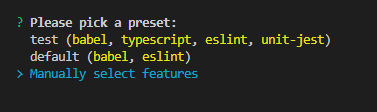
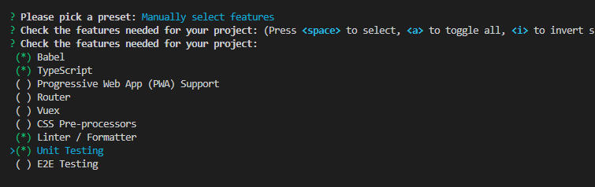
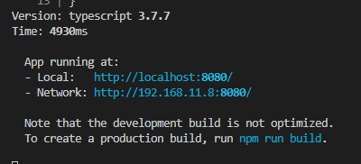
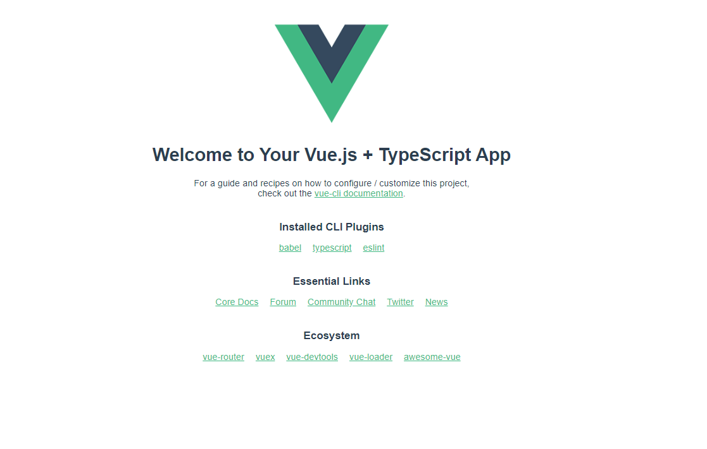
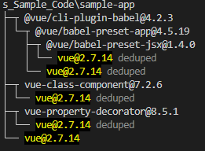

# 環境構築

## Vue CLI とは

---

Vue CLI は、本格的な Vue.js アプリケーション開発をするための環境を構築するツール。Vue CLI では Vue.js 公式ツールに位置づけられている

> 2023 年現在 Vue CLI はメンテナンスモード。新しいプロジェクトを開始する場合は Vite ベースでの開発が推奨されている

- [Vue CLI](https://cli.vuejs.org/#getting-started)

## なぜ Vue CLI を使うのか

---

- ファイル分割をすることでコードの見通しがよくなる
- 最終的にファイルはバンドルされるためコードが軽量化できる
- Babel、TypeScript、ESLint などの Plugin を使い効率的に開発できる
- HMR(Hot Module Replacement)の仕組みを利用できる

## Vue CLI をインストールする

---

- 以下のコマンドで Vue CLI をインストールする
  - `npm install -g @vue/cli@5.0.8`
- Vue CLI のインストールがきちんとできたか確認をする
  - `vue -V `

## プロジェクトを作成する

---

- 以下コマンドでプロジェクトを作成
  - `vue create sample-app`
- Manually select features を選択
  - 矢印キーで選択し、Enter キーで決定
    
  - 該当項目を選択(space キー入力すると選択/選択解除ができる)
    
  - `Use class-style component syntax?`を Yes にする
    
  - `cd sample-app`でフォルダ移動
  - `npm run serve`で開発サーバーを起動する
    
  - ブラウザで確認する
    

## 参考

---

- `npm list vue`で vue のバージョンを確認することができる
  

- CDN の読み込みを利用する場合は以下のようなオンラインサービスでコードを書くことも可能(練習用)
  - [jsfiddle](https://jsfiddle.net/)

## ワーク 1

---

理解があいまいな用語をしらべてまとめよう。
