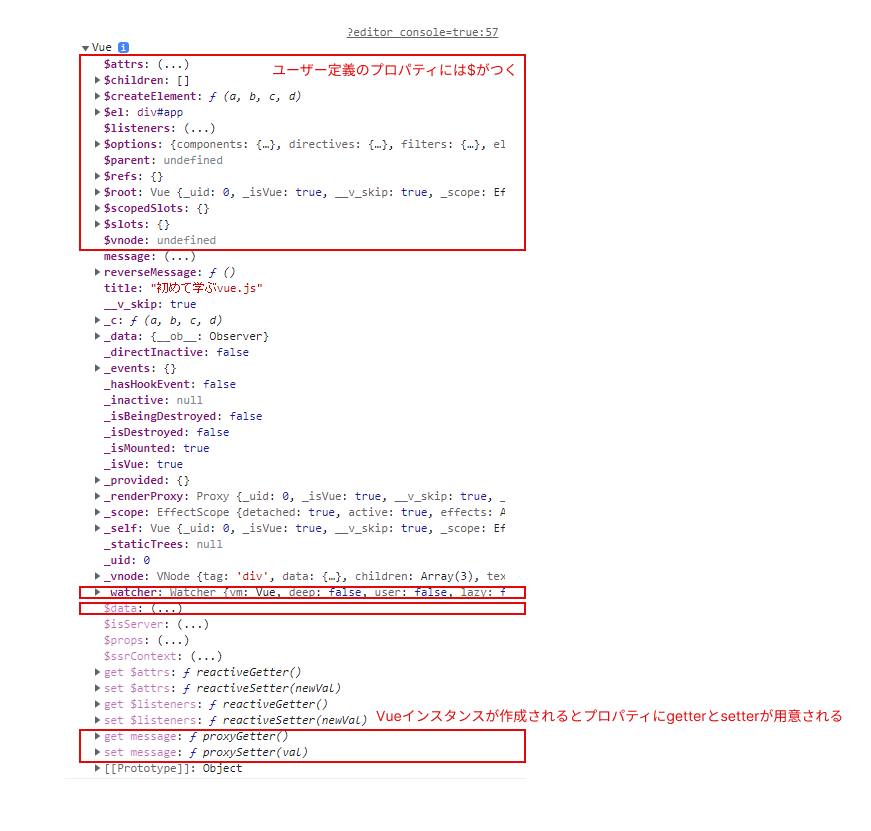
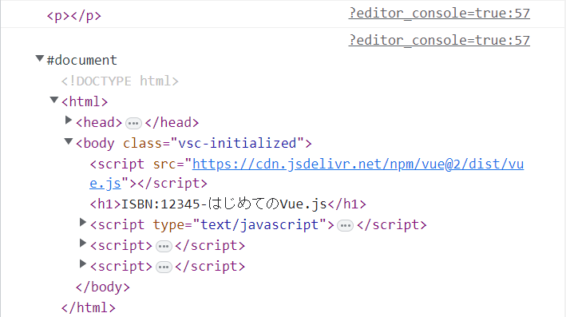
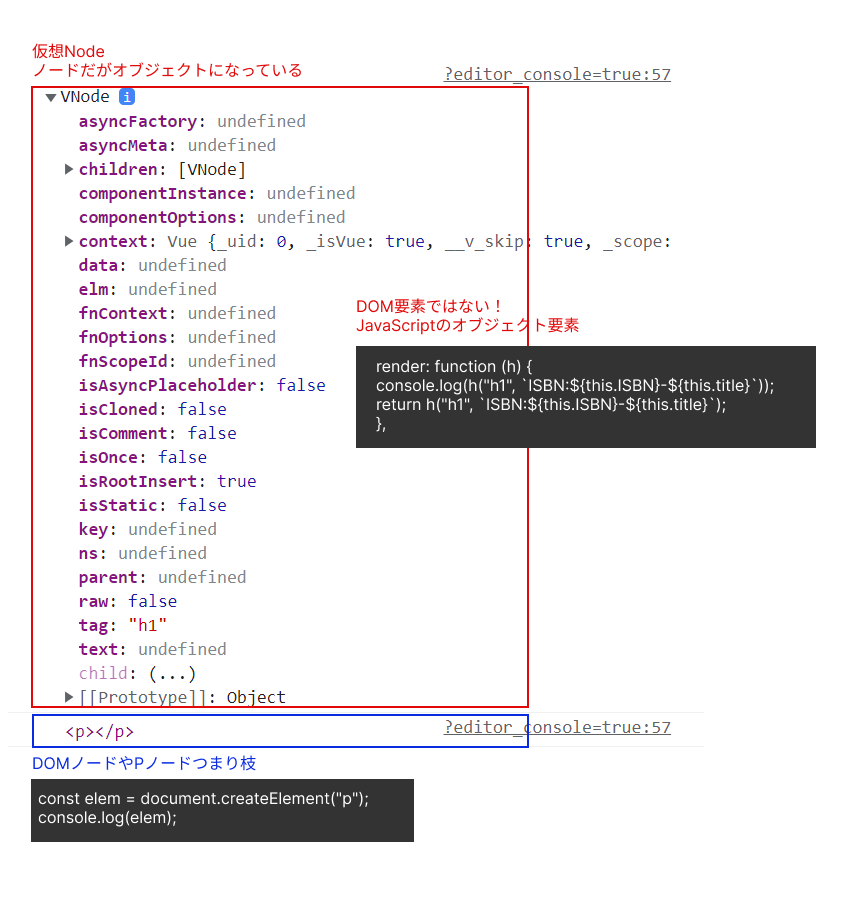

# インスタンスメソッド

サンプルコード：[app.js](../Vue.js_Sample_Code/sample-cdn/app.js)

## Vue のリアクティブシステムを確認する

---

Vue は画面描画されるとデータを変更し、データが変更されると画面が再描画される。

```html
<script src="https://cdn.jsdelivr.net/npm/vue@2/dist/vue.js"></script>

<div id="app">
  <p>{{message}}</p>
</div>
```

```javascript
const vm = new Vue({
  el: "#app",
  data: {
    message: "Hello!",
  },
});
vm.title = "はじめてのVue.js";
console.log(vm);
```



Vue インスタンスが作成されるとユーザ定義の`$data`に対して、`getter`と`setter`が用意され常に監視(`watch`)されるようになる
`$data`外に書いたプロパティに関しては`getter`と`setter`が用意されないためリアクティブなデータにはならない

<div style="page-break-before:always"></div>

## (使うことはないが)data を外部に定義することも可能

---

```html
<script src="https://cdn.jsdelivr.net/npm/vue@2/dist/vue.js"></script>

<div id="app1">
  <p>{{title}}</p>
  <p>{{ISBN}}</p>
</div>
```

```javascript
const data = {
  title: "はじめてのVue.js",
  ISBN: 123445,
};
const vm = new Vue({
  el: "#app1",
  data: data,
});

console.log(data === vm.$data);
console.log(vm);
```

## `$mount`メソッドは`$el`プロパティの代わり

---

```html
<script src="https://cdn.jsdelivr.net/npm/vue@2/dist/vue.js"></script>

<div id="app">
  <p>{{title}}</p>
  <p>{{ISBN}}</p>
</div>
```

```javascript
const vm = new Vue({
  data: {
    title: "はじめてのVue.js",
    ISBN: 12345,
  },
});
vm.$mount("#app");
```

> [vue ガイド-Vue インスタンス](https://v2.ja.vuejs.org/v2/guide/instance.html)

<div style="page-break-before:always"></div>

## Vue 側で html のテンプレートを作る

`template`プロパティを使う

```html
<script src="https://cdn.jsdelivr.net/npm/vue@2/dist/vue.js"></script>

<div id="app"></div>
```

```javascript
const vm = new Vue({
  data: {
    title: "はじめてのVue.js",
    ISBN: 12345,
  },
  template: `<h1>ISBN:{{ISBN}}-{{title}}</h1>`,
});
vm.$mount("#app");
```

## render(描画)関数を使う

---

仮想ノードを作成し、DOM の描画を行う。テンプレートの別の書き方。

```html
<script src="https://cdn.jsdelivr.net/npm/vue@2/dist/vue.js"></script>

<div id="app"></div>
```

```javascript
const vm = new Vue({
  data: {
    title: "はじめてのVue.js",
    ISBN: 12345,
  },
  //第一引数に関数をとれる
  render: function (createElement) {
    //第一引数はタグ、第二引数は中身
    return createElement("h1", `ISBN:${this.ISBN}-${this.title}`);
  },
});
vm.$mount("#app");
```

<div style="page-break-before:always"></div>

### DOM(document Object Model)の createElement とは異なる

---

#### DOM 操作を行う`document.createElement`とは何か

---

- JavaScript から HTML の要素に対して操作を行う DOM API の一つ。
  - DOM とはブラウザが読み取り、HTML のように表示しているもの(JavaScript から HTML を操作するため)
  - `documnet`とはブラウザが HTML を受け取り、HTML を DOM に変換させる(ツリー型の 1 つのオブジェクト)
  - `document.createElement`はブラウザが用意しているメソッド。
  - `documnent`オブジェクトの要素を作成する`createElement()`メソッド。
  - 直接 DOM 要素に追加する

##### DOM 操作をログで確認する

---

```javascript
const vm = new Vue({
  data: {
    title: "はじめてのVue.js",
    ISBN: 12345,
  },
  render: function (createElement) {
    return createElement("h1", `ISBN:${this.ISBN}-${this.title}`);
  },
});
vm.$mount("#app");

const dir = document.createElement("p");
console.log(dir);
console.log(document);
```



> `document`はブラウザが作成したもの(わかりやすく表示させているが実体はオブジェクト)

- オブジェクトを確認する

  ```javascript
  console.dir(document);
  ```

  - [console.dir()とは](https://developer.mozilla.org/ja/docs/Web/API/console/dir)

<div style="page-break-before:always"></div>

#### render 関数の`createElement`とは何か

---

- render 関数の引数は`h`と書き換えても問題なく動く(なんでもよい)

  ```javascript
  const vm = new Vue({
    data: {
      title: "はじめてのVue.js",
      ISBN: 12345,
    },
    render: function (h) {
      return h("h1", `ISBN:${this.ISBN}-${this.title}`);
    },
  });
  vm.$mount("#app");

  const elem = document.createElement("p");
  console.log(elem);
  console.log(document);
  console.dir(document);
  ```

- コンソールで中身を確認

  ```javascript
  const vm = new Vue({
    data: {
      title: "はじめてのVue.js",
      ISBN: 12345,
    },
    render: function (h) {
      console.log(h("h1", `ISBN:${this.ISBN}-${this.title}`));
      return h("h1", `ISBN:${this.ISBN}-${this.title}`);
    },
  });
  vm.$mount("#app");

  const elem = document.createElement("p");
  console.log(elem);
  console.log(document);
  console.dir(document);
  ```

  

- render 関数で作っているものは DOM 要素ではなく Javascript のオブジェクト要素
- render 関数は仮想 node を return している
- **仮想 DOM**を作るために仮想 node(vnode)を作っている

> `document.createElement`は DOM に直接アクセスし、DOM を書き換えている、render 関数の`h`は仮想 node を作って、仮想 DOM に伝えている

<div style="page-break-before:always"></div>

## 仮想 DOM とは？何のために必要か？を改めて

---

### 仮想 DOM とは？

---

仮想 DOM とは DOM のような JavaScript のオブジェクト。DOM は JavaScript が持っている変数などではなく、ブラウザがもっているもの。

### 仮想 DOM は何のために必要か

---

DOM に直接アクセスして、要素を追加したり削除したりするのはパフォーマンスが落ちる。
**_DOM の直接アクセスは極力避けたい_**

> どうすると効率的に DOM の書き換えができるのか？

### ボタンがクリックされると p タグの中身の要素を変更する場合

- DOM の必要な部分だけ更新できるとよい
  - どうすれば必要な部分だけの更新が実現できるか？
    - 変更前の仮想 DOM を作る
    - 変更後の仮想 DOM を作る
    - 差分をみる
    - 差分のみ実際の DOM に反映される($mount は仮想 DOM を実際の DOM に反映させている)

<div style="page-break-before:always"></div>

## ワーク 1

---

この単元で学んだことを自分なりの言葉でまとめて発表しましょう。

> vie インスタンス生成時に data に対して`setter`や`getter`が生まれる意味や仮想 DOM の必要性の理解を深めましょう

## ワーク 2

---

6_am-CLI での操作のワーク 2 をもう一度行いましょう。

> main.ts の中身をより深く見ましょう
