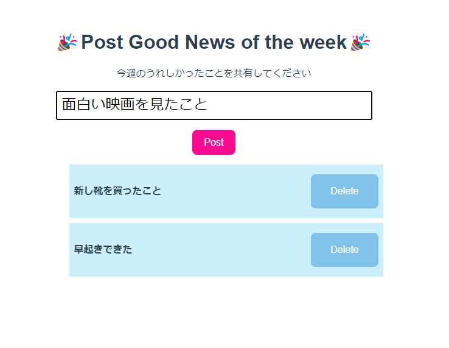
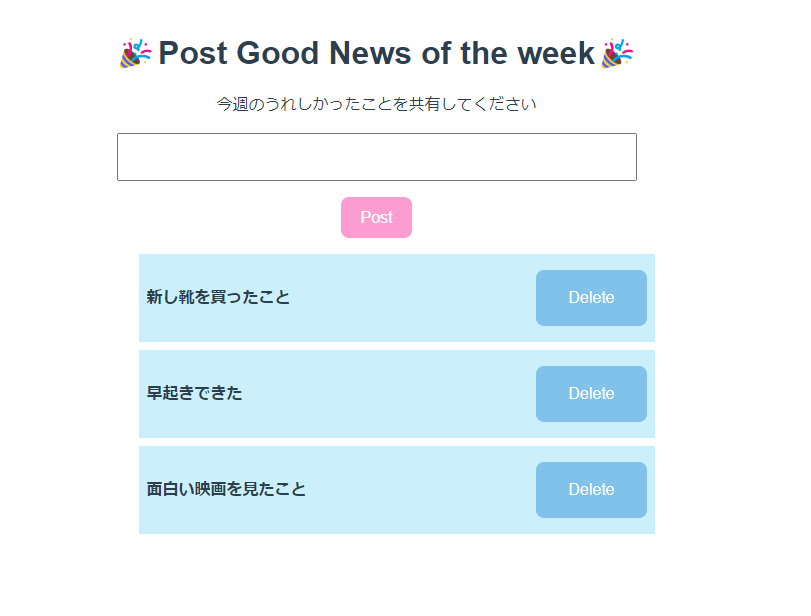

# 確認問題 1

簡単な投稿フォームを作成しましょう。

- 入力エリア(`Form.vue`)、表示エリア(`List.vue`)をそれぞれコンポーネント化する
- それらコンポーネントを親コンポーネント(`App.vue`)で呼び出す
- 親コンポーネントでデータを管理し、親から子へ子から親へデータの受け渡しやイベントの伝播を行う

## 実装イメージ

---

- 初期表示

  - 元々 2 行分の Post がデフォルトで存在している
  - 文字を入力していない場合は「Post」ボタンは非活性とする
  - 

- フォーム入力

  - 「Post」ボタンが活性化する
  - 20 文字以上入力した場合は警告メッセージが表示される
  - 
  - 

- 「Post」押下時

  - リストに投稿内容は反映される
  - 入力フォームは空になる
  - 

- 「Delete」押下時
  - アラートを表示させる
  - アラートで OK を押した場合リストから削除される
  - アラートでキャンセルを押した場合は削除されない
  - 
  - 
