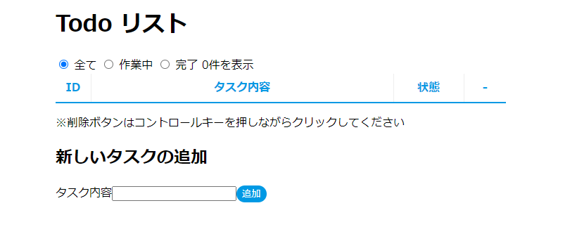
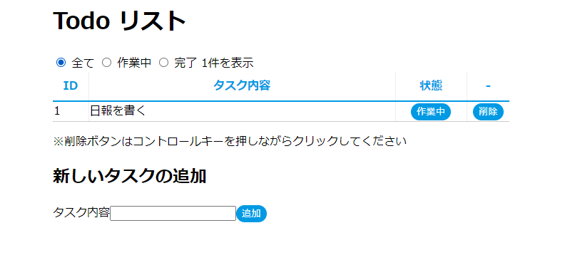
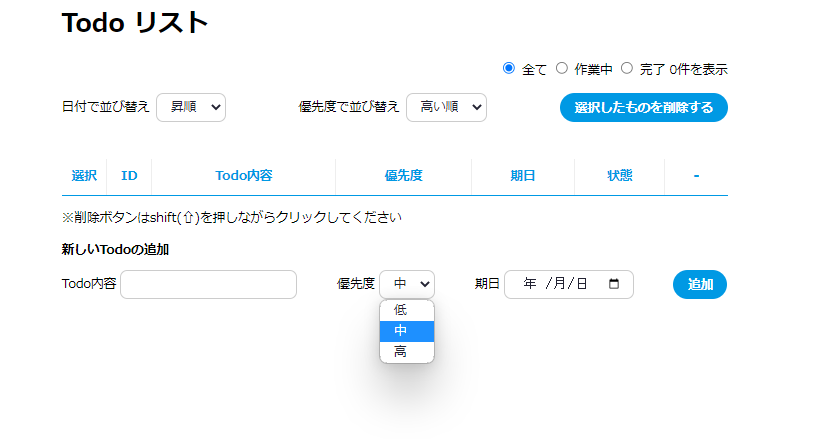
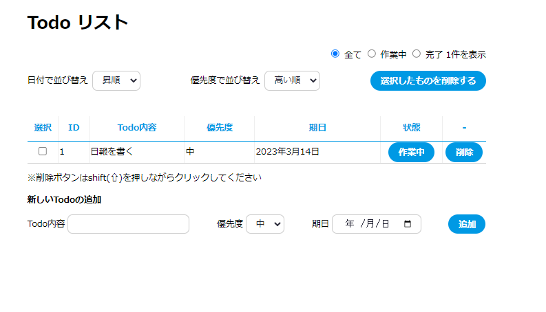
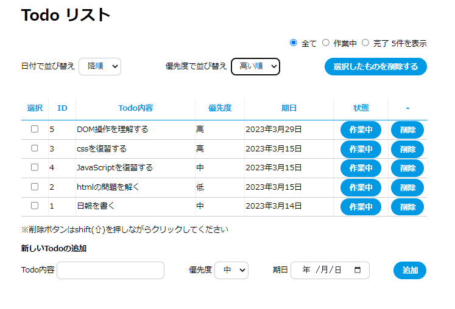
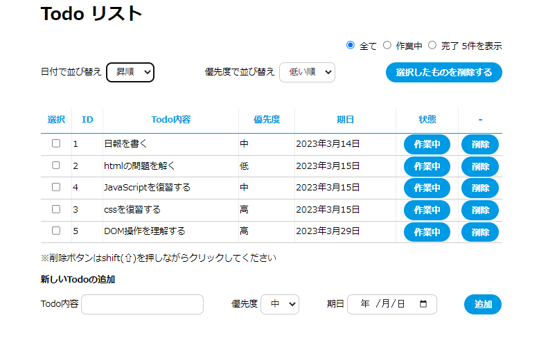

# 確認問題 2

### Todo アプリケーションを作成しよう

`todo-app`プロジェクトを立ち上げ、途中まで完成しているアプリケーションの内容を確認する

---

- 初期表示
  
- タスク追加後
  

### 機能追加イメージ

---

1. 「優先度」、「期日」も登録する

   - 「優先度」はデフォルトで「中」とする
     

2. 選択削除ができるようにする

   - 各タスクの左側にチェックボックスを追加し、「選択したものを削除する」というボタンを画面上部に追加
     

3. 「期限」「優先度」で並び替えがえきるようにする
   
   
